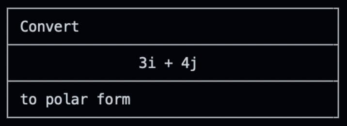
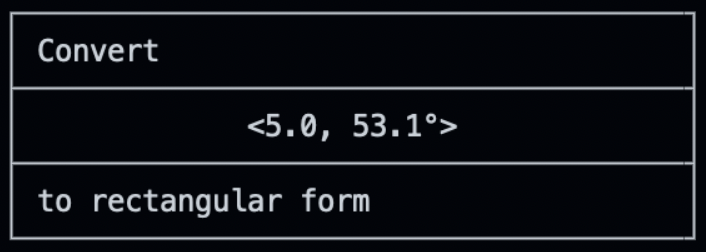

# Designing a Simple 2d Vector Class

## Instructions

- 2/14/23
    - Before changing **anything**, check out a new branch in which to work.

    - Write an `__init__` method for `Vector2d` that has positional parameters for the `x` and `y` components that correspond to the *instance variables* `self.x` and `self.y`

    - Write a `__repr__` method for the `Vector2d` class. A good general rule for `repr` is that it should produce a string similar to the code used to create the object it describes. For example, `repr(Vector2d(3,4))` could produce `'Vector2d(x=3, y=4)'`.

    - Write a `__str__` method for the `Vector2d` class such that `str(Vector2d(3, 4))` would return `'3i + 4j'`. (**i** and **j** are what many physicists and engineers use to denote the x and y directions)

    - Write an `__abs__` function that takes `self` as its only argument and returns the length of the hypotenuse of the right triangle with legs equal to `self.x` and `self.y`. For example, `abs(Vector2d(3, 4))` should return `5.0`.

    - Once you've finished today's work, commit your changes and push them to **your** repository.

- 2/16/23

    - The `__neg__` method determines the behavior of the *unary minus* (leading minus sign) on a `Vector2d` object. Write a `__neg__` method that takes `self` as its only argument and returns a `Vector2d` object with the signs for `x` and `y` negated. For example, `-Vector2d(3, 4)` would return `Vector2d(-3, -4)`.

    - The `__add__` method determines how the '+' symbol works between two `Vector2d` objects. Write an `__add__` method that has two arguments, `self` and `other`, and produces a `Vector2d` object with the correct components. Remember that when we add vectors, we simply add their like components. For example: `Vector2d(3, 4) + Vector2d(1, -1)` should return `Vector2d(4, 3)`, since `3 + 1 = 4` and `4 + -1 = 3`.

    - Once you've finished the day's work, commit your changes and push them to **your** repository.

- 2/22/23

    - The `__eq__` method determines how comparisons using the `==` operator behave. Write an `__eq__` method that takes `self` and `other` as arguments and returns `True` if the `x` and `y` values of `self` and `other` are both equal. `__eq__` should return `False` otherwise.

    - The `__sub__` method determines how the *binary minus*, `-` operator behaves. Write a `__sub__` method that takes `self` and `other` as arguments and returns the difference between the two vectors. For example: `Vector2d(3, 4) - Vector(1, -1)` should return `Vector2d(2, 5)`.

- 2/23/23

    - Write a method called `angle` that has `self` as its only parameter and returns the arctangent **in degrees** of the vector's `y` and `x` components. **NOTE:** You'll want to consult the documentation for [`math.atan2(y, x)`](https://docs.python.org/3/library/math.html#math.atan2) and [`math.degrees(x)`](https://docs.python.org/3/library/math.html#math.degrees)

- 2/28/23

    ### `flash_cards.py`
    - Write a function called `print_conversion` that takes two positional arguments: a `Vector2d` object and a string.
        - If the string is "polar", the flash card should display a conversion *from* rectangular **to** polar form like so:
        
        - If the string is "rectangular", the flash card should display a conversion *from* polar **to** rectangular form like so:
        

- 3/1/23
    ### `flash_cards.py`
    - Write a function called `generate_vector` that takes **no arguments** and returns a `Vector2d` object with **integer** x- and y- components randomly generated between -20 and 20.
    - Write a function called `print_conversion_solution` that takes **two arguments**, a `Vector2d` object and a string (like with your `print_conversion` function) that prints the solution to a conversion problem for a given vector and form. The output should be visually consistent with the output your `print_conversion` function generates. 

- 3/3/23
    ### `flash_cards.py`
    Now that you've written the `generate_vector`, `print_conversion`, and `print_conversion_solution` functions, it's time to put them to work!
    Copy the following code snippet to the bottom of `flash_cards.py`:
    ```python
    if __name__ == '__main__':
        while True:
            # Your code goes in this (infinite) loop


            # But don't forget to break at the right time!
            break
    ```
    Inside the infinite loop, you'll do the following:
    - Ask the user if they'd like to practice conversions to rectangular or polar form.
    - Display a question of the appropriate type based on their answer.
    - Wait for user input before displaying the (correct!) answer.
    - Ask the user if they'd like to receive another question, or quit.
    - Respond accordingly.

    